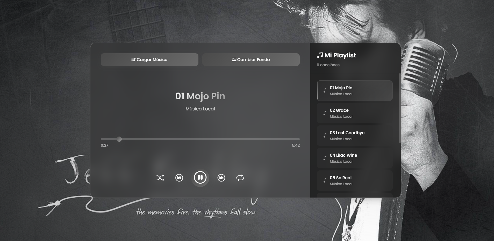

# 🎵 Reproductor de Música

Reproductor de música moderno y responsivo desarrollado con **HTML**, **CSS** y **JavaScript**

  

---

## 🚀 Características

- ▶️ Reproducción y pausa de pistas
- 🔀 Reproducción aleatoria
- 🔁 Modo de repetición
- ⏭️ Cambio de pista (siguiente/anterior)
- 🎚️ Control de volumen
- 💅 Interfaz moderna y responsiva

---

## 📂 Estructura del Proyecto
📁 music/
├── index.html # Página principal
├── style.css # Estilos del reproductor
├── app.js # Lógica en JavaScript
├── /music # Carpeta con archivos MP3
└── /img # Imágenes del proyecto

---

## 🛠️ Tecnologías Utilizadas

- HTML5
- CSS3
- JavaScript
- Font Awesome (íconos)
